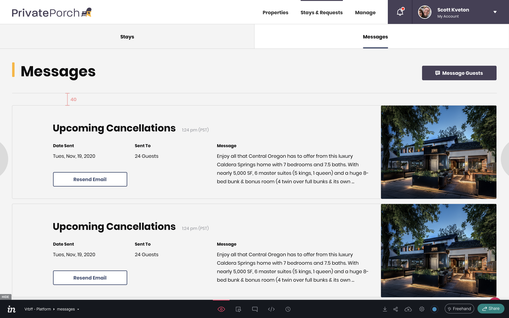
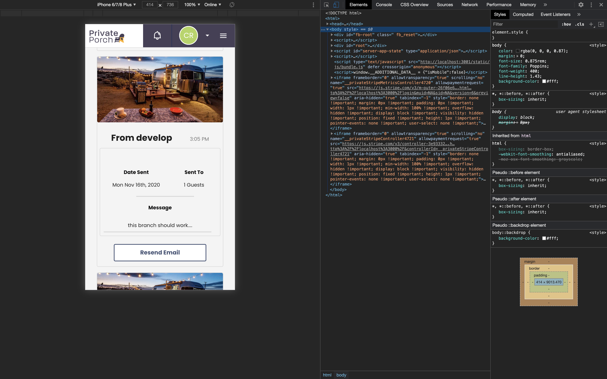
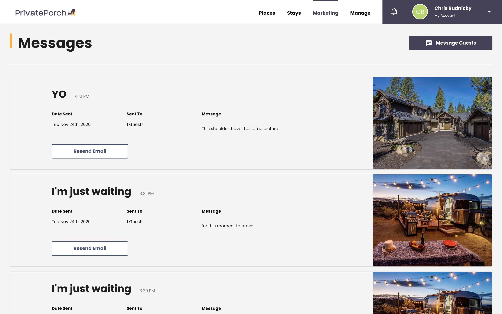
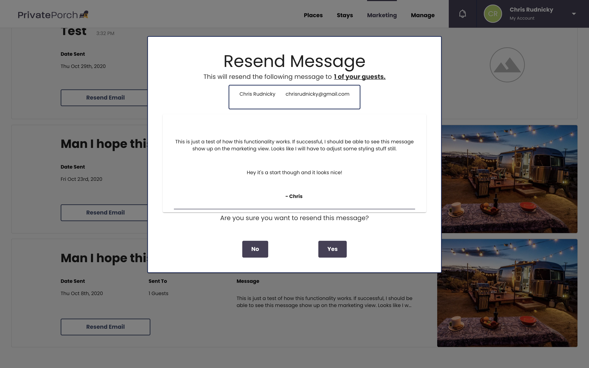

# Private Porch: Development of the Marketing Hub and Guest Message

## Objective

Display data from emails generated by users, match styles, and identify any additional functionality based off invision assets.

## Background

Private Porch is a vacation rental platform that allows homeowners greater level of control over who they rent their vacation homes to. It creates a social network within the application, and is closed to public use. Users of Private Porch can join guest lists for different properties allowing the hosts the ability to communicate via email to their guests.

The 11th release of Private Porch included a feature which added a new page ([`MarketingHub`](#terms)) to the application. The acceptance criteria for the `MarketingHub` feature was loosely defined - most of the request was based off of an invision asset generated by a designer ([fig 1](#fig-1.-marketinghub)).

Engineering the frontend to match the asset ultimately required backend work, but this is out of the scope of this case study. In short, routes were added to the [`api`](#terms), and several columns were added to the `guest_messages` table in the [`DB`](#terms).

## Tech Design

The first consideration for building this feature was how the [`client`](#terms) would get the data necessary to display [`GuestMessages`](#terms). Since content on the [`client`](#terms) is rendered by querying a node server to return react components, the exact state for each view of the application needs to be fetched before each page loads. With this in mind, a component architecture becomes clear: use a container component to handle data fetch, populate the state of the application, fetch the necessary state, and pass it as props to presentation components.

### [Click here for more information on building the component architecture.](./tech_design/component_architecture.md)

After identifying how the application recieves data, the next step was to build the presentation components. Private Porch is a web application and despite it being geared towards desktop users, it will undoubtedly receive a fair amount of mobile traffic. Simply copying the design from [figure 1](#fig-1.-marketinghub) without considering how it would look on smaller screen sizes would be a costly mistake. The majority of the work behind the responsive design would be done on the [`GuestMessage`](#terms) component and resulted in [figure 2](#fig-2.-mobile-guestmessage).

### [Click here for more information on building the presentational components](./tech_design/presentation_components.md)

After designing a responsive layout for [`GuestMessages`](#terms) the last step to completing this feature would be adding behavior around the "Resend Email" button (see [fig 1](#fig-1.-marketinghub)). Again, no invision assets existed for this functionality. Implementing a modal seemed appropriate [figure 4](#fig-4.-resend).

### [Click here for more information on building the resend modal](./resend_messages.md)

## Hurdles

- Data returned from API was not ideal
- Dates

## Limitations

- Frontend bloat
- Does not take advantage of websockets to return data to the client on server actions.

___

## Terms

| Term | Definition |
| --- | --- |
| `Api` | Go API. |
| `Client` | Server side rendered React application. |
| `DB` | Postgres database. |
| `GuestMessage` | Record of an email that a host sends to guests on one of their guest lists. |
| `MarketingHub` | Page that Private Porch users use to interact with guests, and view a history of messages they have sent. |

## Figures

### Fig 1. `MarketingHub`

> 

### Fig 2. Mobile `GuestMessage`

> 

### Fig 3. Completed `MarketingHub`

> 

### Fig 4 Resend Modal 

> 
